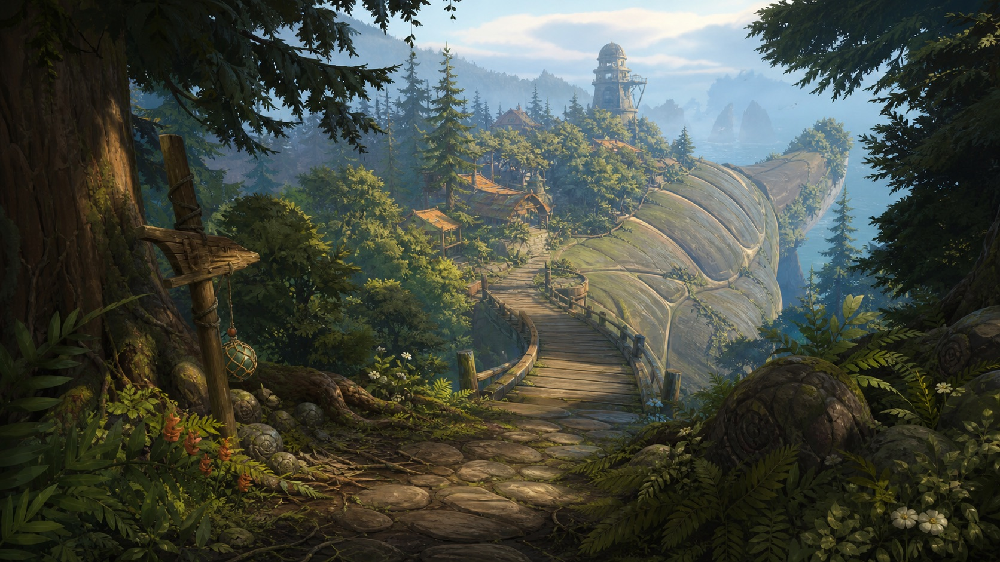
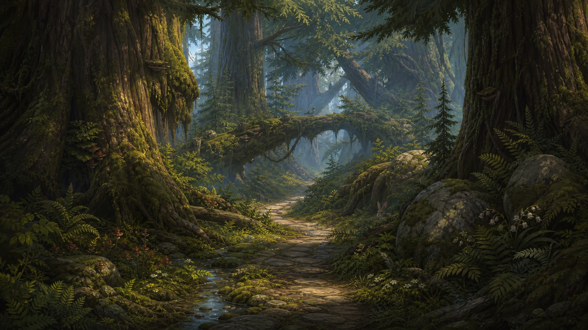
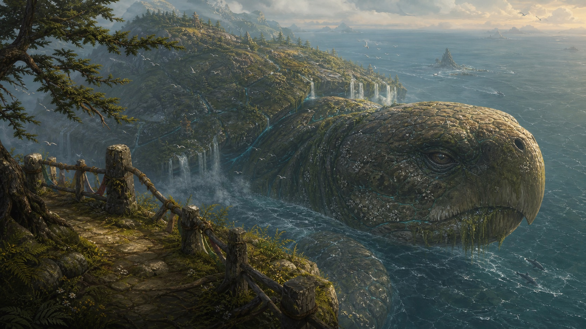
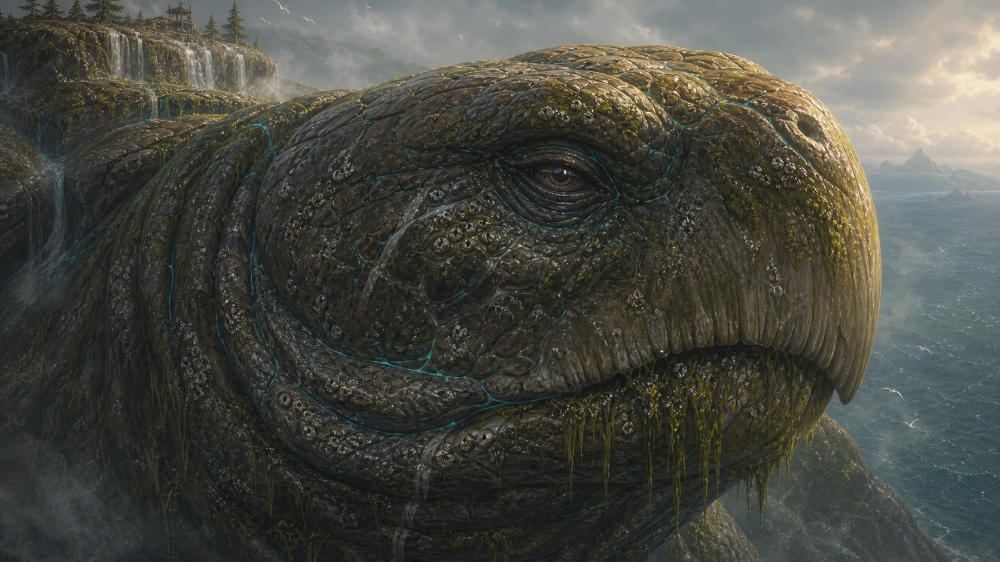
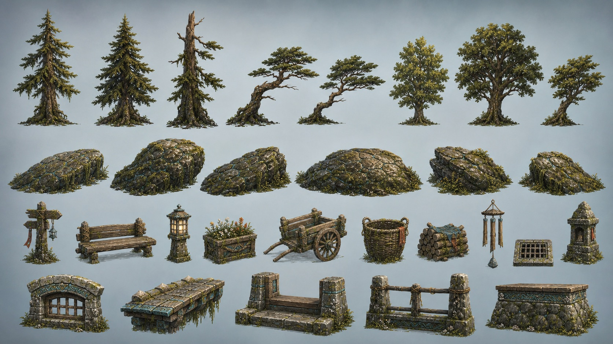
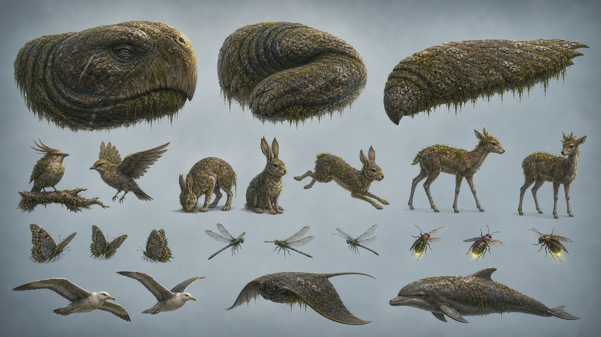

# Slice 1 Art-Direction Board

**Date:** 2026-07-14

**Status:** Candidate direction complete; owner approval is the gate before Slice 2

## Decision

Turtleback Sanctuary uses **painterly monumental naturalism**: believable scale, anatomy, construction, and materials simplified into strong graphic silhouettes, hand-painted color groups, selective texture, and layered atmosphere.

The reference games informed general production principles—composed views, color/fog as design tools, readable distant elements, modular forests, and representative vertical slices. None of their assets, characters, maps, exact palettes, music, or proprietary designs are inputs to these images.

## Canonical style frames

### Arrival Overlook

Transfer to runtime:

- replace the empty-field first impression with dark foreground framing and a clear path;
- preserve a small intentional village clearing rather than blank lawn;
- use shell curvature, plate ridges, forest walls, and the observatory to communicate place;
- keep the bridge and village readable at first glance.

### Crownwood interior

Transfer to runtime:

- require canopy, trunks, midstory, understory, ground cover, deadfall/roots, boulders/water, and mist;
- use an S-curved path and a brighter middle-distance anchor;
- organize detail into large dark masses and selective lit foliage;
- show wildlife as discoveries within habitat, not spawned centre-frame.

### Galecrest turtle reveal

Transfer to runtime:

- show the turtle from a three-quarter side angle during normal traversal;
- crop the nearby head and neck so the player cannot visually contain the creature;
- repeat scale through the overlook rail, shell waterfall, tiny trees/buildings, birds, dolphins, wake, and atmosphere;
- keep the eye small, deep-set, calm, and intelligent.

### Turtle anatomy and material key

Transfer to runtime:

- build a heavy brow, hooked beak, layered jaw/neck folds, and asymmetric growth;
- separate leathery plates, scars, algae, barnacles, keratin, wetness, and cyan seams into readable zones;
- preserve macro form before micro texture;
- keep the head cropped and environmental, never a centered mascot portrait.

## Shape-language boards

### Environment kit

The board establishes the tree silhouette range, shell-derived boulder language, functional story props, and coastal shell-stone/timber trim. See [shape-language.md](shape-language.md) for implementation dimensions and exclusions.

### Turtle and wildlife

The board establishes the non-cute turtle anatomy and the first-wave animal language: songbirds, shell hare, gentle grazer, pollinators, dragonflies/fireflies, seabirds, ray, and dolphin.

## Shared read

Across all six images:

- silhouettes are more important than photographic fidelity;
- warm light/cool shadow and colored mist separate depth;
- vegetation and props appear in habitat/story clusters;
- shell geology, plants, architecture, wildlife, and the turtle share one stylization level;
- cyan is a rare living/mineral accent rather than a neon theme;
- foreground density frames calm openings and monumental reveals.

## WebGL2 feasibility boundary

The target is achievable through a small authored kit, instanced/clustered placement, stable LODs, painterly base-color atlases, restrained normal/roughness detail, directional fog, light cards, particles, and the existing spatial cells. The concept frames do not authorize per-leaf geometry at distance, unique high-resolution textures for every prop, screen-wide volumetrics, ray tracing, or unrestricted dynamic lights.

## Approval record

- [x] Four original style frames exist.
- [x] Environment and wildlife/turtle shape boards exist.
- [x] All images share one palette and material language.
- [x] The turtle rejects the current cute frontal treatment.
- [x] The forest shows the required density layers.
- [x] The direction has an explicit WebGL2 translation.
- [ ] Owner approves this visual direction for Slice 2 implementation.

Generation provenance and prompt records are in [generation-record.md](generation-record.md).
