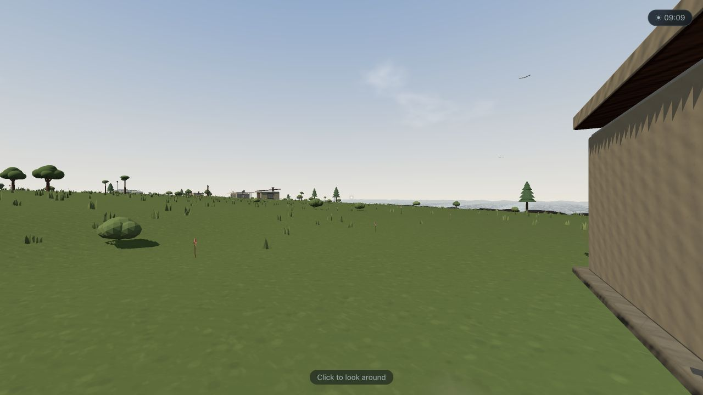
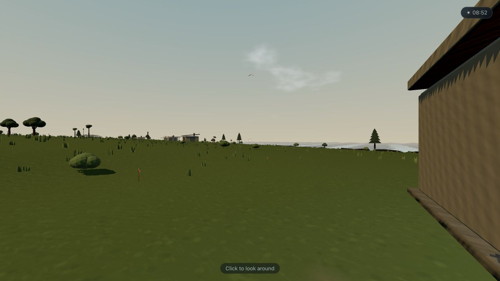
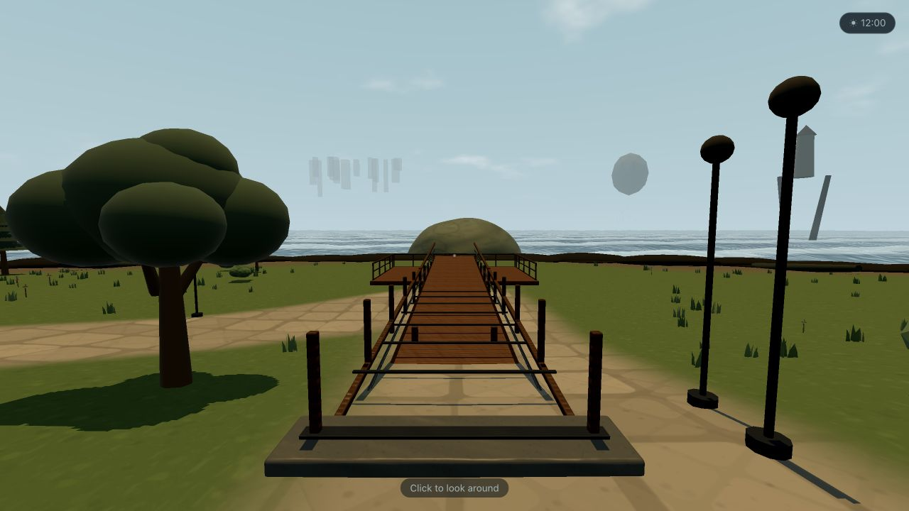
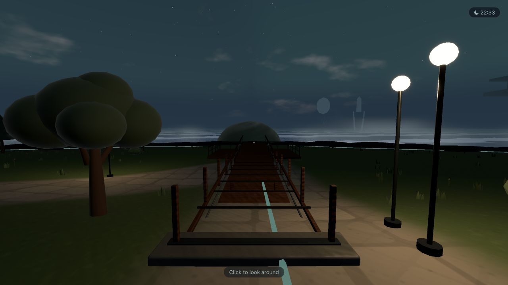
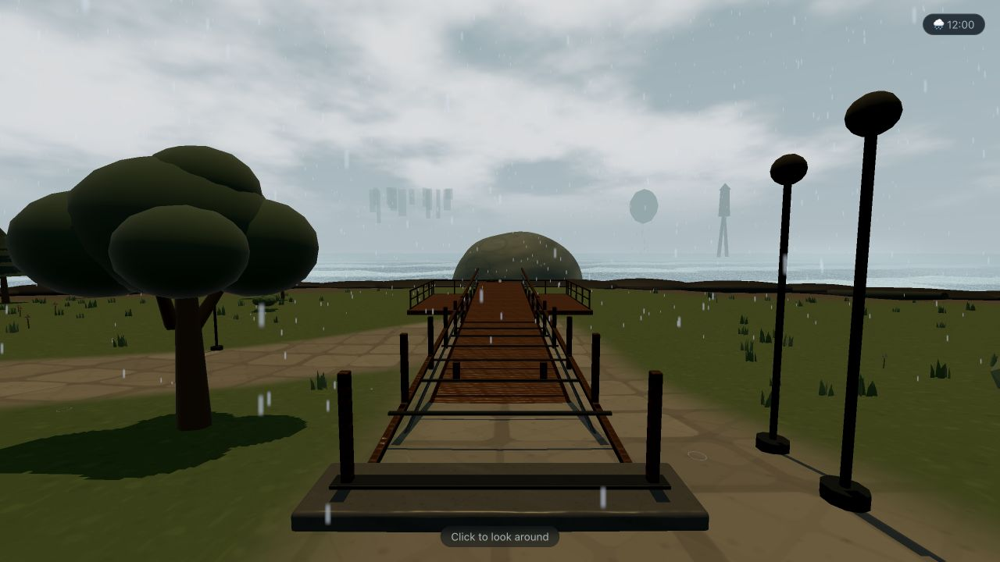
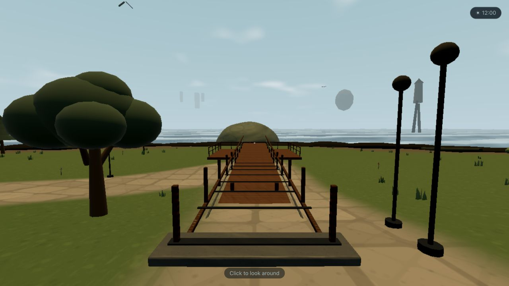
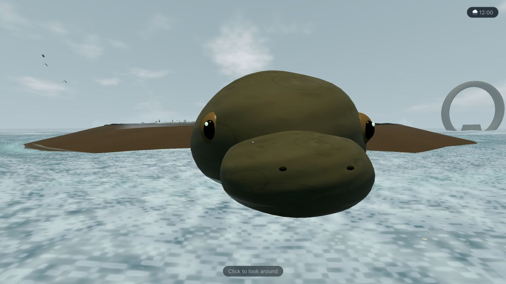

# Slice 2 Runtime Evidence

**Captured:** 2026-07-14

**Viewport:** 1280×720

**Browser:** in-app Chromium/WebGL2 development runtime

## A/B renderer proof

| Before Slice 2                            | Painterly renderer                          |
| ----------------------------------------- | ------------------------------------------- |
|  |  |

The painterly pass replaces the pale blue/green wash with warmer lit planes, cooler organized shadow, a muted coastal sky, broader atmospheric separation, and more legible material groups. Geometry and population density are intentionally unchanged in this comparison; the turtle silhouette and forest overhaul belong to Slices 3 and 4.

## Condition matrix

| High noon clear                              | High night clear                               |
| -------------------------------------------- | ---------------------------------------------- |
|  |  |

| High noon rain                             | Low noon identity                               |
| ------------------------------------------ | ----------------------------------------------- |
|  |  |

## Review record

- The shared shader compiled without WebGL or page errors in the live scene.
- Noon, night, and rain preserve the route, horizon, and local material color.
- Low keeps the same palette, broad silhouettes, and distance-fog identity without relying on bloom.
- The six runtime families are bark, foliage, rock, soil/path, painted wood, and turtle skin.
- Foliage uses authored base-to-tip wind weights; no outline pass was introduced.
- Screenshot evidence adds approximately 416 KiB. Runtime binary asset delta is 0 MiB against the 4 MiB slice budget.
- The deterministic High/noon Arrival diagnostic recorded 184 calls, 676,186 triangles, 44 textures, no fallback assets, and no console errors. Its 274.6 ms p95 used software SwiftShader, so it is retained as topology/error evidence rather than treated as a native-GPU acceptance number.
